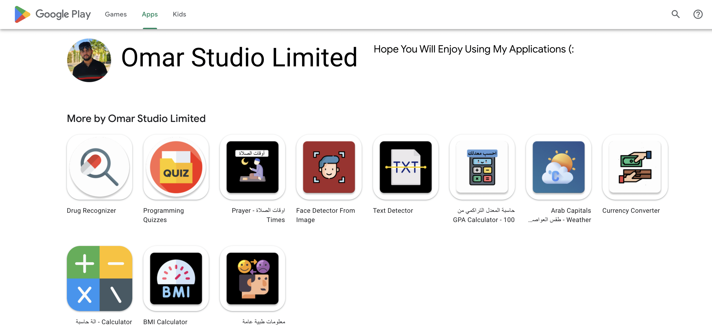

# My Android Apps

1) Arab Weather app 👉 https://github.com/omr1k/Arab_Weather_App
2) Durg Recognizer --------> https://github.com/omr1k/Drug_Recognizer
3) GPA Calculator ---------> https://github.com/omr1k/Gpa_Calculator
4) Medical Info App -------> https://github.com/omr1k/Medical_Info_App
5) Quizzes App ------------> https://github.com/omr1k/Quizzes_For_Programmers_App
6) Prayer Times -----------> https://github.com/omr1k/Prayer_Times_Android_App
7) Face Detector ----------> https://github.com/omr1k/Face_Detector
8) Text Detector ----------> https://github.com/omr1k/Text_Detector
9) BMI Calculator ---------> https://github.com/omr1k/BMI_Calculator
10) Currency Converter ----> https://github.com/omr1k/Currency_Converter

# All the apps are available at google paly store on my developer account
link ---> https://play.google.com/store/apps/dev?id=7955012686824531086

