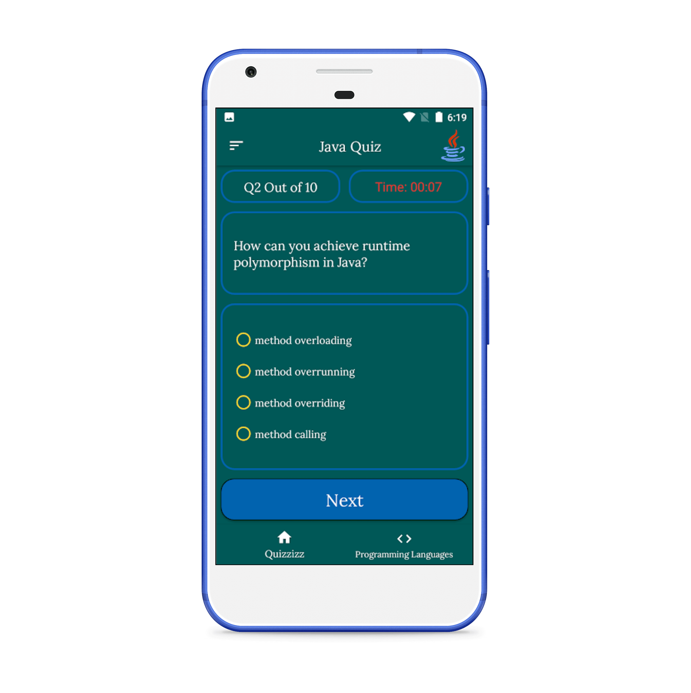
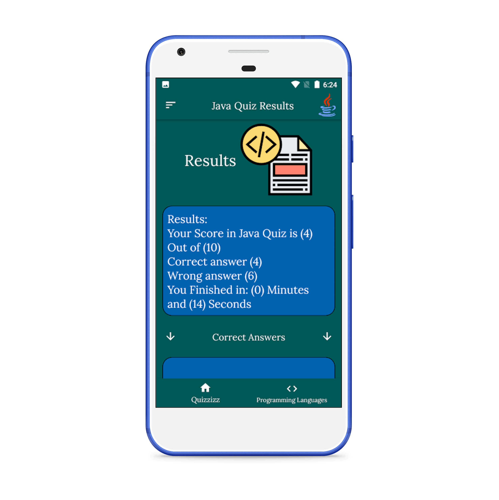

# Drug Recognizer Android Application
[Check project files here](https://github.com/omr1k/Drug_Recognizer)
[Check The app on google play store](https://play.google.com/store/apps/details?id=com.omarstudiolimited.Drug_Recognizer)

# Arab Capitals Weather Android Application
[Check project files here](https://github.com/omr1k/Arab_Weather_App)
[Check The app on google play store](https://play.google.com/store/apps/details?id=com.omarstudiolimited.weatherapp)

# GPA Calculator Android App
[Check project files here](https://github.com/omr1k/Gpa_Calculator)
[Check The app on google play store](https://play.google.com/store/apps/details?id=com.omarstudiolimited.gpa_calculator)

# Currency Converter Android app
[Check project files here](https://github.com/omr1k/Currency_Converter)
[Check The app on google play store](https://play.google.com/store/apps/details?id=com.omarstudiolimited.currencyconverterapp)

# Quizzes Android App
[Check project files here](https://github.com/omr1k/Quizzes_For_Programmers_App)
[Check The app on google play store](https://play.google.com/store/apps/details?id=com.omarstudiolimited.programming_quizzes)

# Habit Tracking app
Track your habits with this app and how many days you did this habits...all data saved using user defaults, [Check project files here](https://github.com/omr1k/iOS_Projects/tree/main/HabitTracking)

# Filter app
In this app I used CoreImage to apply diffrent filters to an image and also implment uiviewcontrollerrepresentable to wrap PHPhotoPicker to use it within swiftUI, [Check project files here](https://github.com/omr1k/iOS_Projects/tree/main/Instafilter) 

